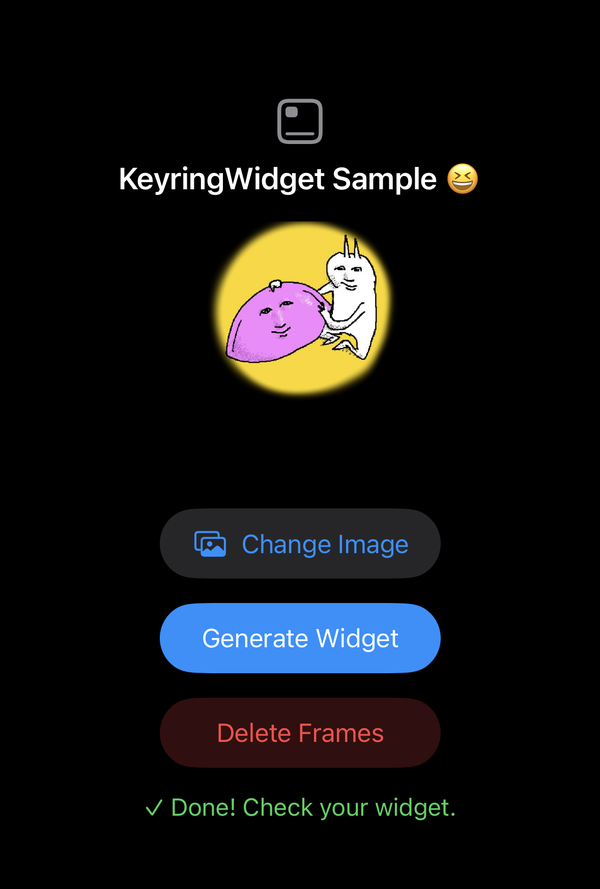
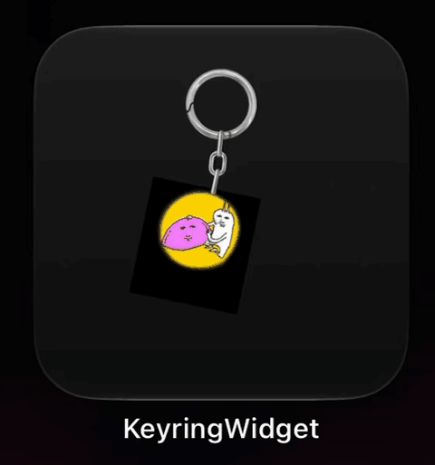

# KeyringWidget

A swinging keyring widget made from one photo. Built with [ClockHandKit](https://github.com/giljihun/ClockHandKit).

[한국어](README.ko.md)

  
  

## How it works

Pick a photo and the app composites it onto 58 keyring frames (30 frames, then 28 in reverse).
The widget stacks every frame and covers each one with a thin arc slice. ClockHandKit's `clockHandRotationEffect` turns the slices, so only one frame shows at a time.

## Run

Open `KeyringWidget.xcodeproj`, set your own Team and App Group, and run it on an iPhone with iOS 26 or later.
Pick a photo, then add the **Keyring** widget to your Home Screen.

## Thanks

Inspired by [Bryce Bostwick's WidgetAnimation](https://github.com/brycebostwick/WidgetAnimation). Originally built for [KEYCHY](https://apps.apple.com/us/app/%ED%82%A4%EC%B9%98-keychy/id6754951347).
